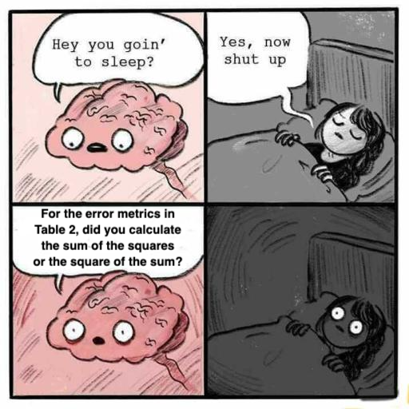
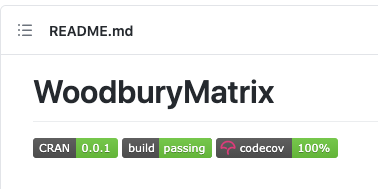

[slack]: images/slack.png "Slack"

## Who I am

```{r, echo = FALSE}
library(ggplot2)
library(dplyr, warn.conflicts = FALSE)

set.seed(20210216)

theme_set(theme_bw())
```

<style>
.container {
  display: flex;
}
.col {
  flex: 1;
}

.reveal section img {
  border: 0;
}

div.sourceCode {
  margin: 0;
}

.largerText {
  font-size: 1.5em !important;
}

.reveal pre {
  width: 95%;
}

.reveal pre code {
  max-height: 550px;
}

strong {
  color: #edb109;
}

strong a {
  color: #d6a313 !important;
}

.slack {
  display: inline-block;
  width: 40px;
  height: 40px;
  background-image: url(images/slack.png);
  background-size: 40px 40px;
}
</style>

A postdoc at the University of Wollongong, working on applied spatio-temporal statistical problems with Noel Cressie and Andrew Zammit-Mangion.

Before that, I was a PhD student at the University of Western Australia.

**Before that, I was a software engineer for 10 years.**

<aside class="notes">
  <div style="font-size: 0.6em">
  So just some quick background on me, I am a postdoc at the University of Wollongong, I work with Noel Cressie and Andrew Zammit-Mangion on problems in environmental statistics.

  Before that I was a PhD student at UWA.

  But before that, I was a software engineer for 10 years. And really this tutorial is about software engineering. These days as students and practitioners in spatio-temporal statistics we spend a lot of time programming. There are a lot of lessons to be learned from the field of software engineering, and I want to share some of those.
  </div>
</aside>

## Assumed programming knowledge

- You have programmed before.
- You can read basic R or Python.

If you're at an earlier stage and want to learn more about these, see Danielle Navarro's great textbook [[1]](#/resources) or the R for Data Science book [[2]](#/resources).

## ⚠️ Warning ⚠️

This tutorial is rather informal and unscholarly. It is full of opinions and observations from my own experience.

The hope is to provoke discussion on good coding practices within this community.

Please share your thoughts, opinions, rants, etc. in Slack at any time! <span class="slack">&nbsp;</span>

We will stop for questions and discussion a few times.

<aside class="notes">
  <div style="font-size: 0.6em">
  I think it's fair to start this tutorial with a warning. This is not really a very formal or scholarly tutorial. That's why I've put emoji's on this slide.

  That said, I am passionate about good coding practices. I have tried to pick topics that are not particularly controversial, and the main goal is to spark a discussion about our coding practices and how to improve them.

  I'd love for this tutorial to be interactive. We'll stop a few times for questions and discussion, so please load up Slack with your thoughts and we'll catch up there. Then at the end there'll be a good chunk of time for a chat.
  </div>
</aside>

## Motivation



<aside class="notes">
  This image serves as a motivation for the tutorial. I have had this happen to me, maybe you have to. Well actually for me it was Table 4, but you get the idea. The specific bug doesn't matter either. It's the vibe.
</aside>

---

There are several things that can (should?) keep a statistician from falling asleep at night.

One of those is Simpson's paradox:

```{r, echo = FALSE, fig.width = 5, fig.height = 3.5}
x <- rnorm(128)
simpson_df <- bind_rows(
  data.frame(x = x - 4, y = 4 + x + rnorm(length(x), sd = 0.5)),
  data.frame(x = x - 2, y = 2 + x + rnorm(length(x), sd = 0.5)),
  data.frame(x = x + 0, y = 0 + x + rnorm(length(x), sd = 0.5)),
  data.frame(x = x + 2, y = -2 + x + rnorm(length(x), sd = 0.5)),
  data.frame(x = x + 4, y = -4 + x + rnorm(length(x), sd = 0.5))
)

ggplot(simpson_df, aes(x, y)) +
  geom_point() +
  geom_abline(
    intercept = c(0, -8, -4, 0, 4, 8),
    slope = c(-1, 1, 1, 1, 1, 1),
    linetype = c('solid', rep('dashed', 5)),
    colour = c('red', rep('blue', 5)),
    size = 1
  )
```

**Another is having bugs 🐞 in your code.**

<aside class="notes">
  <div style="font-size: 0.6em">
  There are a few things that can keep a statistician awake at night when they should be sleeping. Actually there are a lot of things, but here are two.

  One of those is Simpson's paradox. This little plot should send shivers down your spine - look how in each of the five subgroups the trend goes one way, but if you look at the overall trend it's the opposite. Let's hope you know about these subgroups if you're going to do causal inference...

  But that's not the topic of the talk. Because another thing that should keep a statistician up at night is the prospect of having bugs in your code.
  </div>
</aside>

## Story time 📊 🐞

Reinhart, C, M.; Rogoff, K. S. (2010). Growth in a Time of Debt. *American Economic Review*. 100 (2): 573–78. doi:10.1257/aer.100.2.573.

Their conclusions led several governments to implement financial austerity programs.

A student reproducing the work found that they'd made an error in a formula in their Excel spreadsheet, invalidating some of their empirical claims.

<aside class="notes">
  <div style="font-size: 0.6em">
  So there's a infamous example of this. This economics paper by Reinhart and Rogoff in 2010 about the relationship between growth and debt partially led many countries to implement so-called austerity policies.

  Later, a student found that the authors had a small error in a formula that led to a wrong result.

  You might think this is just a problem with Excel, but...
  </div>
</aside>

## Story time

My first research project...

<aside class="notes">
  <div style="font-size: 0.6em">
  - The first time I ever did research was in computer science, back in my undergrad.
  - I was trying to reproduce the results of a published paper. This was in computer science, but the specific topic doesn't matter. I had implemented their methods, and some of the numbers I was getting in a simulation study were different to the authors.
  - So I asked the authors for their own code so I could compare. They kindly obliged, and it turned out they had a bug in one of their methods. In fact I had made the same error in the same method earlier but, luckily, I'd noticed it. They weren't so lucky.
  - Perhaps it doesn't matter in the grand scheme of things, but one part of their results were wrong, a little blip in science. I did tell them but nothing really came of it---I'm not blaming them---and I left it.
  - But it's just sad, really, to have a little bit of science wrong. I have seen this again since.
  - In all cases the work was peer-reviewed.
  - How does this happen?
  </div>
</aside>


## Your stories and a poll

If you've had a similar experience, feel free to share it in the Slack chat and we can discuss it a bit later.

🗳️ Now let's just run a quick poll... 🗳️

<aside class="notes">
  So we're going to stop for a second and put a poll up. Orange elf, could you do that please?

  In the meantime, I'd remind you about the slack. I've shared some of my own stories about bugs, maybe you have some of your own? Maybe even bugs in your own work? Feel free to share if you'd like and we'll look at those a bit later.
</aside>

## Peer review: the crown jewel of science 👑

We peer review each other's work prior to publication.

- Keeps us honest
- Encourages rigour
- Ensures the work is useful
- **Catches errors**

But it generally only applies to the written part of the work. If the numbers reported look plausible, there's (usually) an assumption that they are computed correctly.

<span style="font-size: 1.5em">Code is a blind spot for peer review.</span>

<aside class="notes">
  <div style="font-size: 0.6em">
  Here's my opinion on the matter.

  Peer review is the crown jewel of science. It keeps us honest, it's a check on just making whatever claim you want. It encourages rigour, mathematical and otherwise. It ensures the work is worthy of publishing in that it is useful at all. And, most importantly, it provides a final line of defense against errors.

  But, to me, there is one key limitation of peer review. Which is that it applies only to the written part of the work. While people often release their code these days, it's almost never subject to peer review. If the numbers in the work look plausible, there's usually an assumption that they were at least computed correctly.

  So you could say that code is a blind spot for peer review.
  </div>
</aside>

## How big is the blind spot?

It's hard to be objective about this, but take two examples:

- One (short) chapter of my PhD thesis:
  - Lines of LaTeX: \~300
  - Lines of code: \~1,400 - **4.5x more**
- Paper submitted based on a longer chapter:
  - Lines of LaTeX: \~1000
  - Lines of code: \~13,000 - **13x more**

<aside class="notes">
  <div style="font-size: 0.6em">
  Now we might then want to ask how big is the blind spot. There is probably no good way to quantify this, but I thought I'd make a small attempt.

  So I took a look at two chapters of my PhD thesis. I counted the number of lines of latex in the chapter, and then the number of lines of code. This is probably an apples and oranges comparison, but it's just meant to be a heuristic.

  So for one short chapter there were 300 lines of latex, and around 1400 lines of code. 4.5 times as much

  For a longer chapter, there were around 1,000 lines of latex, 13,000 lines of code. That is a pretty complex method so the code is pretty long. 13 times as much.

  So here the unreviewed component is pretty big! I'm pretty sure there are no major bugs, but it's always a worry.

  So hopefully that's a somewhat convincing argument for why you should be thinking about this.
  </div>
</aside>

----

Bugs aren't just a problem in academic work. Professional software developers invest huge effort into avoiding and fixing bugs.

Some gold standard strategies the best teams use:

- **Peer review**: software is not released until the code has been read by multiple people
- **Dedicated testing teams**: you can get paid to break code, all day! https://www.seek.com.au/software-tester-jobs

<br />

<span style="font-size: 1.5em">Most academics don't get to use these strategies...</span>

<aside class="notes">
  <div style="font-size: 0.6em">
  So bugs should be a huge concern in academic work.

  But they are also a concern in professional software work. Software engineers invest huge effort into avoiding and fixing bugs.

  There are lots and lots of strategies. But two gold-standard strategies, used by the best teams are peer review and dedicated testing teams.

  In peer review, the software is not released until the code has been read by multiple people. Every time a change is made to the code, that is reviewed too. It's similar to academic peer review.

  Lots of companies have dedicated testing teams. People actually get paid to break code, all day, every day! They don't even have to write the code.

  Unfortunately, these are not an option for most academics. Most of the code is worked on by one person and no-one else looks at it.
  </div>
</aside>

----

There are some strategies that an individual programmer can use, *right now*.

We'll cover three:

- **Strategy 1: Make your code easier to understand**
- **Strategy 2: Defensive programming**
- **Strategy 3: Automated testing**

<aside class="notes">
  So what academics when coding need are strategies to avoid bugs that work for an individual, not a team.

  I'll talk about two. The first is making your code easier to understand. And the second is called defensive programming, I'll define that later.

  There's one other major one that I won't cover here, which is automated testing. This is worthy of its own talk, but I'll provide some resources at the end.

  Now for the two strategies we will talk about, there's a common vein. And it comes back to the underlying cause of all bugs...
</aside>

## Every bug can be traced back to a wrong assumption.

<div style="text-align: left;">
  The person who wrote the code made the assumption.<br />
  &rArr; You wrote the code.<br />
  &rArr; **You caused the bug :(**
</div>

<br />

What you need are ways to:

- *Make your assumptions more obvious* so you avoid making wrong ones (Strategy 1).
- *Make it so you know when an assumption is violated* so you can find and fix the error (Strategies 2 and 3).

<aside class="notes">
  So let's think about how bugs arise. And there's some bad news.

  Ultimately, every bug can be traced back to a wrong assumption. It might be about the input data, or it might be an assumption in one of the steps. Sometimes the assumptions isn't on your radar when you wrote the code, such as that there might be missing values in the data.

  Now of course, the person who wrote the code made the assumption. And, in most cases, you wrote the code. So, sadly, you caused the bug.

  So what you need are strategies to help yourself. You need a way to make your assumptions more obvious, so you avoid making wrong ones. And for the assumptions you do know about, you need to know when they are violated.

  That's what the two strategies are all about.
</aside>

# Strategy 1: Make your code easier to understand

Code that is hard to read is hard to understand.

You should strive to make your code clean and readable.

This helps:

- **You** now, when you debug the code
- **You** in the future when you read the code
- **Everyone** who reads the code

<aside class="notes">
  <div style="font-size: 0.6em">
  So the first strategy is to make your code easier to understand.

  You should strive to make your code clean and readable, we'll talk about that.

  This will help you in two ways. It will help you now when you need to write the code and debug it. And it will help you in future, maybe months or years later, when you look at the code and try to figure out what the heck you were doing. I'll show an example of that later.

  It will also, obviously, help anyone else who reads the code.
  </div>
</aside>

## The DRY principle

Don't Repeat Yourself.

$$
  \textrm{RMS}(x_1, \ldots, x_n) = \sqrt{\frac{1}{n} \sum_{i = 1}^n x_i^2}
$$

::: {.container}
:::: {.col}
```py
rms1 = np.sqrt(np.mean(
  np.square(error1)
))
rms2 = np.sqrt(np.mean(
  np.square(error2)
))
```
::::
:::: {.col}
```py
def rms(x):
    '''Return the root mean square of
    the vector x'''
    return np.sqrt(np.mean(
      np.square(x)
    ))


rms1 = rms(error1)
rms2 = rms(error2)
```
::::
:::

<aside class="notes">
  <div style="font-size: 0.6em">
  There's is a principle called the D R Y principle, it stands for don't repeat yourself. That's don't repeat yourself, in case you didn't hear me the first time.

  Here's an example in Python. On the left we are computing the root-mean-square of two variables, e1 and e2. There's no bug here, but there's lots of repetition, which makes the code harder to read. On the right I've moved some code into a function, so now there's no repetition. And I think it's easier to read this way.
  </div>
</aside>

## Follow a style guide

Style guides list rules to follow when laying out your code.

You should start from a publicly available guide.

**For R, you can follow the Tidyverse style guide [[3]](#/resources).**

**For Python, the standard is called PEP 8 [[4]](#/resources).**

You can tweak the guidelines to suit you, but not following some style guide is like writing a paper with inconsistent grammar, or using two different citation styles in the same document (Bertolacci, 2020).

<aside class="notes">
  <div style="font-size: 0.6em">
  One of the best things you can do to make clean code is to follow a style guide. Styles guides list rules for how to lay out your code. Things like, how to indent your code, don't have lines that are too long, put spaces around operators, and so on.

  The easiest thing is to start from a publicly available guide, I've listed one for R and one for Python.

  You can tweak the guidelines if you have specific preferences, just be consistent. Not following a style guide is like writing a paper with bad grammer, or switchihg between citation styles in the same document. It just makes things harder to read.
  </div>
</aside>

## R style example

::: {.container}
:::: {.col}
Non-compliant:

```r
y <- x*2
if(y > 2) {
  z <- y + 2
}
sqrt_z <- sqrt (z)
```
::::
:::: {.col}
Compliant:

```r
y <- x * 2
if (y > 2) {
  z <- y + 2
}
sqrt_z <- sqrt(z)
```
::::
:::

The R package [`lintr`](https://github.com/jimhester/lintr) [[5]](#/resources) can check your code automatically:

```
example.R:1:7: style: Put spaces around all infix operators.
y <- x*2
     ~^~
example.R:2:3: style: Place a space before left parenthesis, except in a function call.
if(y > 2) {
  ^
example.R:5:11: style: Remove spaces before the left parenthesis in a function call.
sqrt_z <- sqrt (z)
```

<aside class="notes">
  <div style="font-size: 0.6em">
  Here's an example in R. On the top left there's an example that doesn't follow the tidyverse guide. On the right it does.

  There's a great R package called lintr which can help you by checking your code automatically. Here's the output when run on the program on the left.

  It tells you which lines don't comply. Some editors, like RStudio or vim, can run this for you. Eventually, writing compliant code becomes second nature.
  </div>
</aside>

## Python style example

::: {.container}
:::: {.col}
Non-compliant:

```py
y = x*2
if y> 2:
   z = y + 2
sqrt_z = sqrt (z)
```
::::
:::: {.col}
Compliant:

```py
y = x * 2
if y > 2:
    z = y + 2
sqrt_z = sqrt(z)
```
::::
:::

The program [pycodestyle](https://pypi.org/project/pycodestyle/) [[6]](#/resources) checks if you are following the rules:

```
example.py:2:5: E225 missing whitespace around operator
example.py:3:4: E111 indentation is not a multiple of four
example.py:4:14: E211 whitespace before '('
```

<aside class="notes">
  <div style="font-size: 0.6em">
  In Python there is a similar program called pycodestyle that checks the PEP 8 style I mentioned. Here's the same program as in R, more or less, and the output for pycodestyle below.
  </div>
</aside>

---

Sometimes you knew what the code does when you wrote it, but a few months later...

```r
loc<-c(137.5, -4.7)
loc2<-c(77.5, 18.1)
dat<-read.csv('locations.csv')
d=2*3389.5*asin(sqrt(
sin((dat$lat*pi/180-loc[2]*pi/180)/2)^2
+cos(dat$lat*pi/180)*cos(loc[2]*pi/180)
*sin((dat$lon*pi/180-loc[1]*pi/180)/2)^2))
d2=2*3389.5*asin(sqrt(
sin((dat$lat*pi/180-loc2[2]*pi/180)/2)^2
+cos(dat$lat*pi/180)*cos(loc2[2]*pi/180)
*sin((dat$lon*pi/180-loc2[1]*pi/180)/2)^2))
#dat$nrst=-1
dat$nrst=0
for(i in 1:nrow(dat)){
if(d[i]<d2[i])
dat$nrst[i]<-1
else
dat$nrst[i]<-2
}
```

<aside class="notes">
  <div style="font-size: 0.6em">
  Now I thought I'd show an example in R with a lot going on at the same time.

  Imagine you wrote this program a few months ago, can you figure out what it's doing?

  But look, there are these vectors called loc and loc2, what are those? What's this weird number 3389.5? What does nrst stand for?

  There's this repeated bit with small changes too, that violates the D R Y principle. There are some multiplications by pi over 180, maybe that's a conversion from degrees to radians.

  There are lots of smart cookies in the audience, so you might have some idea. You might be able to guess, but you shouldn't have to.

  There are also some style issues here.
  </div>
</aside>

---

```r
MARS_RADIUS <- 3389.5  # in kilometres

hav_deg <- function(x) sin(x * pi / 360) ^ 2
cos_deg <- function(x) cos(x * pi / 180)
mars_haversine_dist <- function(locations, origin) {
  with(locations, {
    2 * MARS_RADIUS * asin(sqrt(
      hav_deg(latitude - origin['latitude'])
      + cos_deg(latitude) * cos_deg(origin['latitude'])
      * hav_deg(longitude - origin['longitude'])
    ))
  })
}

curiosity_location <- c(longitude = 137.5, latitude = -4.7)
perseverance_location <- c(longitude = 77.5, latitude = 18.1)

locations <- read.csv('locations.csv')
curiousity_dist <- mars_haversine_dist(locations, curiosity_location)
perseverance_dist <- mars_haversine_dist(locations, perseverance_location)

locations$nearest_rover <- 'none'
for (i in 1 : nrow(locations)) {
  if (curiousity_dist[i] < perseverance_dist[i]) {
    locations$nearest_rover[i] <- 'curiousity'
  } else {
    locations$nearest_rover[i] <- 'perseverance'
  }
}
```

<aside class="notes">
  <div style="font-size: 0.6em">
  Now here's a cleaned-up version, luckily I wrote this program a few days ago, not months ago, so I know what it does.

  Well the weird number now has a name, it's called MARS_RADIUS. That's a good hint.

  Now there's a function called mars_haversine_dist. Ahhh, so that computes a distance on Mars using the haversine formula. The repetition is gone for the conversions to radians too.

  Now the location variables have better names, curiousity location and perseverance location. These are the locations of two Mars rovers. Actually Perseverance isn't on Mars yet but it's going to land here.

  And now is we scroll down and look at the end, it might be a bit clearer that we have a table of locations ON MARS, and we are finding the distance between these locations and the rovers, then finding the closest rover.

  All this is relatively easy to figure out because the code uses nice names for everything, doesn't repeat itself, and has a logical layout. If you read this code years from now, there's a good chance you will understand its purpose, at least partly.
  </div>
</aside>

## Comments

**A rule of thumb:** Comments in code should say *what* your code does, not explain *how*.

::: {.container}
:::: {.col}
Unhelpful:

```r
mars_haversine_dist <- function(
  locations,
  origin
) {
  # Take two times the radius times
  # the arcsine of the square root
  # of ...
  ...
}
```
::::
:::: {.col}
Helpful:

```r
# Calculate the distance in
# kilometres between two coordinates
# on Mars
mars_haversine_dist <- function(
  locations,
  origin
) {
  ...
}
```
::::
:::

The code should be clean enough that the *how* is obvious.

(I break this rule around 10% of the time.)

<aside class="notes">
  <div style="font-size: 0.6em">
  Now a lot of people are told that it's really important to comment your code. I don't disagree with that at all, comments are good. But they shouldn't substitute for good code.

  My view on this is that comments should, basically, say what the code does, not how.

  Here's an example. Just repeating the haversine distance function from the previous example. On the left is what I think is an unhelpful comment, explaining the equation. But if the code is nicely written you shouldn't need that.

  On the right is a more helpful comment that explains what the function does. It would be even better if it described how the function arguments work, but there's not enough space for that on this slide.

  Like every rule of thumb, you end up breaking it sometimes. Sometimes the maths in the code is complicated enough that it needs some explanation or a reference, and that's okay.
  </div>
</aside>

## Long functions

**A rule of thumb**: functions should fit on one or two screenfuls.

> The maximum length of a function is inversely proportional to the complexity and indentation level of that function. So, if you have a conceptually simple function that is just one long (but simple) case-statement, where you have to do lots of small things for a lot of different cases, it’s OK to have a longer function. <br/>
> - Linus Torvalds [[7]](#/resources)

(I break this rule around 10% of the time)

<aside class="notes">
  <div style="font-size: 0.6em">
  Here's another little rule of thumb: functions should fit on one or two screenfuls. Of course if you aren't writing your own functions that much yet, this advice isn't for you. You should learn how to do that first.

  But if you are, this advice can help you make nice functions. The idea is to split long functions into smaller functions.

  Here's a quote from Linus Torvalds, the person who first wrote and still maintains the Linux operating system. (read it out)

  So this advice is certainly not absolute, it's fine for some functions to be longer.
  </div>
</aside>

## Long files

You should also organise your code into multiple well-named files.

**A rule of thumb**: code files should not be too long, say no longer than 1000-2000 lines.

(I break this rule less often.)

<aside class="notes">
  <div style="font-size: 0.6em">
  Now another useful idea is to divide your code into multiple well-named files.

  How to do this, how to organise a project, is a huge topic and we don't have time to go through it properly here.

  But just a little rule of thumb is that those files should again not be too long, say no longer than 1000 or 2000 lines. I break this rule less often, there's not much cost to splitting code up into different files.
  </div>
</aside>

## More clean code tips

- Code for correctness and readability first.
- Shorter isn't necessarily better---short programs don't run any faster!
- Tab completion in your editor means you don't have to type longer function and variable names every time.
- Picking good names for things is hard, but it's worth the effort.

<aside class="notes">
  <div style="font-size: 0.6em">
  So that's about it for clean code. It helps you understand your code, which helps you notice your assumptions, which helps you avoid bugs.

  I've put some further tips for you to read in your own time. I'll just highlight the first one, that you should code for readability and correctness first. Other concerns like speed can come later.
  </div>
</aside>

## Discussion on clean code 🗣️

Questions? Comments? Disagreements?

**Feel free to add your own clean code tips to Slack!** <span class="slack">&nbsp;</span>

Or raise your hand in the Zoom chat. ✋

# Strategy 2: Defensive programming...

...or, dead programs tell no lies [[8]](#/resources).

<aside class="notes">
  <div style="font-size: 0.6em">
  Okay, now our second strategy, defensive programming. There's a great saying about this called "dead programs tell no lies" from a book called The Pragmatic Programmer by Thomas and Hunt. Let's see what this means.
  </div>
</aside>

## A tale of two errors...

```{r, echo = FALSE}
y <- round(rnorm(5), 2)
y[2] <- NA
```

::: {.container}
:::: {.col}
```{r}
n <- length(y)
sigma <- 1
log_likelihood <- (
  - n * log(2 * pi) / 2
  - n * log(sigma)
  - sum(y ^ 2 / sigma ^ 2) / 2
)
bic <- log(n) - 2 * log_likelihood
print(bic)
```

No explicit error, but you probably don't want that value to be `NA`. What's the root cause?
::::
:::: {.col}
```r
dat <- data.frame(x = 1 : 10)
dat$y <- sin(df$x)
fit <- lm(y ~ x, data = dat)
print(coef(fit))
plot(dat$x, fitted(dat$y))
```

```
## Error in df$x: object of type
##   'closure' is not subsettable
```

Explicit error; annoying, but offending line is obvious.
::::
:::

<aside class="notes">
  <div style="font-size: 0.6em">
  So I've put two R programs here, one on the left, one on the right. On the left it's calculating a Gaussian log likelihood of some vector y with standard deviation sigma, then a BIC value. And look, we got the dreaded NA answer, which is typically a missing value.

  There's no explicit error here, no line failed. So you have to figure out the root cause. Luckily at least we noticed the NA.

  Now on the right, there's code with another problem. And instead of a bad answer, the code threw an error. In fact a classic R error. Now in a lot of ways this is a much nicer error than on the left because you know the offending line immediately. It threw an error.

  This is what is meant by dead programs tell no lies. Code that actually stops because of an error is better than code that continues to run and gives the wrong answer.
  </div>
</aside>

## Dead programs tell no lies

Defensive programming can be used when you're aware you're making an assumption. The idea is to intentionally throw an error when an assumption found to be false.

Most languages have functions to help you do this.

<strong>This way, you don't have to search for the offending line.</strong>

<aside class="notes">
  <div style="font-size: 0.6em">
  The idea of defensive programming is to harness the previous insight intentionally.

  You can use it when you KNOW you're making an assumption. The idea is to make the code throw an error when the assumption is violated.

  Most languages have functions to help with this, we'll see those shortly. Like in the examples before, this means you don't have to go searching for the problem.
  </div>
</aside>

---

Example: the exponential covariance function,

$$
  C(\mathbf{x}, \mathbf{x}') \equiv \exp\left( -\frac{||\mathbf{x} - \mathbf{x}'||}{l} \right)
$$

where $l > 0$.

In R, you can use the **`stopifnot`** function:

```r
# Given a vector or matrix x, return the covariance matrix based on the
# exponential covariance function
cov_exponential <- function(x, length_scale) {
  stopifnot(length_scale > 0)
  exp(-fields::rdist(x) / length_scale)
}

cov_exponential(y, -1)
```

```
## Error in cov_exponential(y, -1): length_scale > 0 is not TRUE
```

<aside class="notes">
  <div style="font-size: 0.6em">
  Here's a statistical example in R. At the top I've given the definition of the exponential covariance function, between two points x and x prime. One of the things you will notice is that it has one parameter, l, called the length scale, and it must be greater than zero.

  And below is some R code that implements it, as the comment says. Now the first line of the function cov_exponential has a line using an R function called `stopifnot`. This function will throw an error if the expression inside it is false.

  The error is very informative, as you can see. Now if you notice, without this stopifnot expression, the function would blindly accept a negative length and return a number. But you know up front that the length scale should be positive. So if you ever accidently pass a number in that's negative, you're find out straight away.
  </div>
</aside>

---

In Python, you can use the **`assert`** keyword:

```python
import numpy as np

def cov_exponential(x, length_scale):
    '''Given a vector or matrix x, return the covariance matrix based on the
    exponential covariance function'''
    assert length_scale > 0, 'length_scale must be positive'
    return np.exp(-np.linalg.norm(x) / length_scale)

cov_exponential(y, -1)
```

```
Traceback (most recent call last):
  File "example.py", line 7, in <module>
    cov_exponential(y, -1)
  File "example.py", line 4, in cov_exponential
    assert length_scale > 0, 'length_scale must be positive'
AssertionError: length_scale must be positive
```

<aside class="notes">
  <div style="font-size: 0.6em">
  In python there is an equivalent keyword called assert. Here's the exact same program written in Python. Again if you call the function with a negative length scale, you get an error immediately.
  </div>
</aside>

## Back to the tale of two errors

```r
stopifnot(all(!is.na(y)))
n <- length(y)
sigma <- 1
log_likelihood <- (
  - n * log(2 * pi) / 2
  - n * log(sigma)
  - sum(y ^ 2 / sigma ^ 2) / 2
)
bic <- log(n) - 2 * log_likelihood
print(bic)
```

```
## Error: all(!is.na(y)) is not TRUE
```

<aside class="notes">
  <div style="font-size: 0.6em">
  So just to return to our tale of two errors, the silent failure example. Well some debugging showed that the error was due to a missing value in the input vector y. If we add this first line using stopfinot, we can be alerted to the error before it happens.
  </div>
</aside>

## More defensive programming tips

- You won't always know what assumptions you're making implicitly immediately.
- But! when your code breaks, add a `stopifnot` or `assert` to catch it next
  time.
- Don't feel the need to check *everything*, just the most important parts.
- In R, the `assertthat` package [[9]](#/resources) can help.

<aside class="notes">
  <div style="font-size: 0.6em">
  Here are some further tips on defensive programming.

  The first thing is, unfortunately, you don't always know what assumptions you're actually making. There are lots of ways to break code.

  But when you do notice a problem and figure out the root cause, you can go back and add a `stopifnot` or `assert` to catch it next time. That way your code gets more robust.

  Don't feel the need to check every tiny assumptions. Just the most important ones, and the ones that end up catching you.

  Finally, if you want to branch beyond `stopifnot`, the `assertthat` package has some great functions that help. But you can also just use `if` statements when it makes sense.
  </div>
</aside>

## Discussion on defensive programming 🗣️

Questions? Comments? Disagreements?

**Feel free to add your own defensive programming tips to Slack!** <span class="slack">&nbsp;</span>

Or raise your hand in the Zoom chat. ✋

(But note that we will talk about a related topic, automated testing, very soon.)

<aside class="notes">
  <div style="font-size: 0.6em">
  So it's time for another discussion. Maybe a bit shorter this time, we'll see. Any questions in the Slack?
  </div>
</aside>

# Strategy 3: Automated testing

Defensive programming actively tests your assumptions when the code is running.

Automated testing goes one step further: you write code that calls your code, actively probing for problems.

<aside class="notes">
  <div style="font-size: 0.6em">
  Okay, here's out last strategy. It's a fair bit more advanced that the last two, but it's very useful if you can get it going.

  It's automated testing. In defensive programming, you add code to your existing code to check your assumptions. In automated testing, you write a whole lot of new code that tests your code for your, actively problem for errors.

  Let's see an example...
  </div>
</aside>

---

::: {.container}
:::: {.col}
`add_one.py`:

```python
def add_one(x):
  '''Returns the argument, plus one'''
  return x + 1.1
```
::::
:::: {.col}
`test_add_one.py`:

```python
from add_one import add_one

def test_add_one():
  assert add_one(1) == 2
```
::::
:::

Running the tests:

<pre><code>======================= test session starts ========================
<span style="font-weight: bold">collected 1 item</span>

test_add_one.py <span style="color: #b5432c">F                                            [100%]</span>
============================= FAILURES =============================
<span style="font-weight:  bold; color: #b5432c">___________________________ test_add_one ___________________________</span>

    def test_add_one():
>     assert add_one(1) == 2
<span style="font-weight:  bold; color: #b5432c">E     assert 2.1 == 2
E      +  where 2.1 = add_one(1)

test_add_one.py</span>:4: AssertionError
===================== short test summary info ======================
FAILED test_add_one.py::test_add_one - assert 2.1 == 2
<span style="color: #b5432c">=================== 1 failed, 0 passed in 0.15s ====================</span>
</pre></code>

<aside class="notes">
  <div style="font-size: 0.6em">
  Here's a little example in Python. In the top left if a few short Python program. It's a function called add_one. You can see from the description that it's meant to return, basically, x + 1. Trivial, you wouldn't write it, but it's an example.

  On the right is a test for this function. It's in a separate file, that's how it works in Python. It has a little function, test_add_one, that uses the assert keyword again. And it's just running one little tests, that one plus one equals two.

  Then at the bottom is the output when we run the tests. You can see that the test fails. It tells you very precisely what went wrong. In this case maybe there was a typo in the function, it looks like we've been adding 1.1 to the number. Whoops!
  </div>
</aside>

## What makes for a good set of tests?

- Each test tests one thing at a time
- Tests are short and simple; don't test too many things
- Boundary conditions are tested
- All code lines are explored

```py
def max_one(x):
  '''Return the maximum between the argument and one'''
  if x < 1:
    return 1
  else:
    return x

def test_max_one():
  assert max_one(0) == 1  # First code path
  assert max_one(1) == 1  # Boundary condition
  assert max_one(2) == 2  # Second code path
```

<aside class="notes">
  <div style="font-size: 0.6em">
  So there's a bit of an art to writing tests. It can be very tempting to write lots and lots of complicated tests.

  Generally it's found that's not worth the time. It's better to have short, simple tests that test one thing at a time.

  One important idea is to test the boundary conditions of the function, whatever that means in context. Here's another example. Another related idea is to make sure that every line of code is run by some test.

  Here's an example. This function just takes the maximum of the argument and 1. So if the argument is less than 1, it returns 1.

  The test has three cases: one for less than one, one equal to one, the boundary condition, and one more than one. Therefore all paths in the function are explored, and so is the boundary condition (though it's trivial in this case).
  </div>
</aside>
---

`covariance.py`:

```python
import numpy as np

def cov_exponential(x, length_scale):
    '''Given a vector or matrix x, return the covariance matrix based on the
    exponential covariance function'''
    assert length_scale > 0, 'length_scale must be positive'
    return np.exp(-np.linalg.norm(x) / length_scale)
```

`test_covariance.py`:

```python
import pytest
import numpy as np

from covariance import cov_exponential

def test_cov_exponential():
    assert cov_exponential([0, 0], 1) == 1.0
    assert cov_exponential([0, 1], 1) == np.exp(-1)
    assert cov_exponential([0, 1], 2) == np.exp(-1 / 2)
    with pytest.raises(AssertionError):
        cov_exponential([0, 0], -1)
```

<aside class="notes">
  <div style="font-size: 0.6em">
  Here's a more complicated example based on the cov_exponential function we had earlier in the defensive programming section. Remember we added an assertion to this function so it throws an error if the length scale argument is negative.

  The test checks a few things: the covariance between two identical locations, it varies the length scale too.

  And it also checks whether an error occurs when a negative length scale is given. The test only passes if the error occurs. That's an interesting feature of tests, they can actually check that code fails when it should fail.
  </div>
</aside>

## Testing in Python and R

The preceding Python examples use the **`pytest`** framework [[10]](#/resources). Tests go into files with names starting with "`test_`"

In R, you can use the testthat package [[11]](#/resources)

<aside class="notes">
  <div style="font-size: 0.6em">
  The preceding examples were in Python and they used the pytest framework, the link is given in the resources at the end. Tests go into files named with test_. The pytest software has great documentation, so you can learn a lot about how to use it from its website.

  If you are using R, there is the testthat package which has a similar philosophy, so let's see that.
  </div>
</aside>

---

::: {.container}
:::: {.col}
`add_one.R`:

```r
add_one <- function(x) {
  x + 1.1
}
```
::::
:::: {.col}
`test_add_one.R`:

```r
source('add_one.R')
context('add_one')

test_that('adding one to one makes two', {
  expect_equal(add_one(1), 2)
})
```
::::
:::

Running it in an R session:

<pre><code>> testthat::test_file('test_add_one.R')

<span style="font-weight:  bold">══ Testing test_add_one.R ═════════════════════════════════════════════════</span>
[ <span style="color: orange">FAIL</span> 1 | <span style="color: purple">WARN</span> 0 | <span style="color: blue">SKIP</span> 0 | <span style="color: green">PASS</span> 0 ]

<span style="font-weight:  bold">── <span style="color: orange">Failure</span> (test_add_one.R:8:3): adding one to one makes two ──────────────</span>
add_one(1) not equal to 2.
1/1 mismatches
[1] 2.1 - 2 == 0.1

[ <span style="color: orange">FAIL</span> 1 | <span style="color: purple">WARN</span> 0 | <span style="color: blue">SKIP</span> 0 | <span style="color: green">PASS</span> 0 ]
</code></pre>

<aside class="notes">
  <div style="font-size: 0.6em">
  Here's a really simple example, the same as the first Python example but in R. Using the add_one function. The code is in the top left, the test in the top right.

  The functions are a bit different, it doesn't use the assert keyword anymore. In fact it's rather readable: we expect that add_one applied to 1 will be equal to 2.

  The output of running the test is at the bottom. You can see it fails again, it's the same bug actually.
  </div>
</aside>

## Testing an R package

In R you can also test a package. Here are the tests for one of mine, WoodburyMatrix [[12]](#/resources):

<pre><code>> devtools::test('WoodburyMatrix')

Testing WoodburyMatrix
<span style="color: green">✓</span> |  OK <span style="color: orange">F</span> <span style="color: purple">W</span> <span style="color: blue">S</span> | Context
<span style="color: green">✓</span> |  89       | WoodburyMatrix <span style="color: #28A6A8">[0.7 s]</span>
<span style="color: green">✓</span> |   1       | lints <span style="color: #28A6A8">[3.9 s]</span>
<span style="color: green">✓</span> |   9       | normal distribution

<span style="font-weight:  bold">══ Results ═══════════════════════════════════════════════════════════════</span>
<span style="color: #28A6A8">Duration: 4.8 s</span>

[ <span style="color: orange">FAIL</span> 0 | <span style="color: purple">WARN</span> 0 | <span style="color: blue">SKIP</span> 0 | <span style="color: green">PASS</span> 99 ]
</code></pre>

Here there are 99 separate checks.

A guide to setting this up is in the R packages book [[13]](#/resources).

<aside class="notes">
  <div style="font-size: 0.6em">
  If you have organised your code into an R package, you can test that too. How to do that is described in the R packages book.

  Here's example output from a package I've written. You can see that 99 separate tests are run.
  </div>
</aside>

## Testing and version control

You may have seen these badges on repositories on GitHub:



Tests are automatically run when changes to the software are published. The code coverage metric counts how many lines of code in the software are tested.

This is beyond what most small research projects need, but it's nice to have!

<aside class="notes">
  <div style="font-size: 0.6em">
  Now you may have seen if you've gone to Github and looked at code that some people have these little badges on their software.

  The build badge actually corresponds to test results. If all the test results pass this goes green. What's neat is that it is run automatically when the code is updated on the website. So if you get really advanced and have your code well organised and on github you can start setting up tests like this.

  The 100% is actually a measure of how many lines of code in the software are tested by the tests.
  </div>
</aside>

## How to make the most of automated testing

A few thoughts on automated testing:

- Automated testing is helpful when your code is already organised into functions (or packages).
- If a function is hard to test, it might be too complicated anyway. Break it up into smaller functions.
- If you find a bug, write a test for the bug that fails, THEN fix the bug

<aside class="notes">
  <div style="font-size: 0.6em">
  Here are just a few final thoughts on testing. It's most helpful if your software is already well organised, that's why I put it as the last strategy.

  There's another little rule of thumb that if you are finding a function hard to write a test for, it might be too complicated. So you might consider breaking it up at that point.

  And finally, quite similar to the advice for defensive programming, if you find a bug in your code you can actually add a test for it so it doesn't come back. In fact you might even write the test before you fix the bug
  </div>
</aside>

# Other strategies

- Version control, such as git [[14]](#/resources).
- Not reinventing the wheel. If a mature package has a function you need, use that rather than write your own.
- Automated checking for common bugs:
  - The **`pylint`** program can do this for Python [[15]](#/resources).
  - The **`lintr`** package does a little bit of this [[5]](#/resources).
- To me, most important: Internal peer review:
  - Can a coauthor or a friend **read your code** for you?

<aside class="notes">
  <div style="font-size: 0.6em">
  So those are the two strategies, clean code and defensive programming.

  There are a few more that I don't have time to go into. The main ones are automated testing, which means writing programs to check your programs. There are lot of resources on this, some are given here.

  It is good to not reinvent the wheel. If a good package has a function you need, use that rather than write your own.

  Finally there are some cool and useful tools around that can spot some bugs automatically. They aren't that smart but they are better than nothing, I've listed them.

  Another idea is to do some internal peer review by asking a coauthor to read your code. Of course, you'll probably want the code to be nice and clean before you do!
  </div>
</aside>

# Conclusion

Bugs can taint otherwise great research, and peer review (probably) won't catch them.

Some easy-to-follow strategies can help you avoid some bugs. Practice makes perfect!

Sadly, though, there will always be more bugs. **If you find a way to avoid them all, please tell me!**

<span style="font-size: 1.5em">Thanks everyone!</span>

<aside class="notes">
  <div style="font-size: 0.6em">
  And that's all I have for you, so I'll sum up.

  Bugs can taint otherwise great research, formal peer review often won't catch them for you.

  There are some easy to follow strategies to help you. They get easier and more effective as you practice, too.

  Of course, the sad fact of the matter is that there will always be more bugs. There are just too many ways things can go wrong. But that said, if you do find a way to avoid them all, please let me know!

  So that's the main content. Now for discussion.
  </div>
</aside>

# Discussion 🗣️

That's the end of the content, now this is space for free form discussion on anything related to the topic of good coding practices.

**Please write your thoughts on Slack** <span class="slack">&nbsp;</span>

Or raise your hand in the Zoom chat. ✋

# Resources

<div style="text-align: left; font-size: 0.5em">
  [1] Navarro, D. (2021). *Learning Statistics with R*. Published online at [https://learningstatisticswithr.com/](https://learningstatisticswithr.com/). <br />
  [2] Wickham, H. and Grolemund, G. (2021). *R for Data Science*. Published online at [https://r4ds.had.co.nz/](https://r4ds.had.co.nz/). <br />
  [3] Wickham, H. (2021). *The tidyverse Style Guide*. Published online at [https://style.tidyverse.org/](https://style.tidyverse.org/). <br />
  [4] van Rossum, G., Warsaw, B., and Coghlan, N. PEP 8---Style Guide for Python Code. [https://www.python.org/dev/peps/pep-0008/](https://www.python.org/dev/peps/pep-0008/), last accessed 2021-02-16. <br />
  [5] Hester, J., Angly, F., and Hyde, R. (2020). lintr: A 'Linter' for R Code. R package version 2.0.1. [https://CRAN.R-project.org/package=lintr](https://CRAN.R-project.org/package=lintr). <br />
  [6] Rocholl, J. and Lee, I., and other contributors. pycodestyle---Python Style Guide Checker. [https://pypi.org/project/pycodestyle/](https://pypi.org/project/pycodestyle/). <br />
  [7] Torvalds, L. (2016). Linus kernel coding style. [https://www.kernel.org/doc/html/v4.10/process/coding-style.html#functions](https://www.kernel.org/doc/html/v4.10/process/coding-style.html#functions) <br/>
  [8] Thomas, D., Hunt, A. (2019). *The Pragmatic Programmer: Your Journey to Mastery* (20th ed.). Addison-Wesley Professional, Boston, MA. <br />
  [9] Wickham, H. (2019). assertthat: Easy Pre and Post Assertions. R package version 0.2.1. https://CRAN.R-project.org/package=assertthat. <br />
  [10] Krekel, H., and other contributors (2021). pytest. [https://docs.pytest.org/en/stable/](https://docs.pytest.org/en/stable/). <br />
  [11] Wickham, H. (2011). testthat: Get Started with Testing. The R Journal, vol. 3, no. 1, pp.
  5--10.<br/>
  [12] Bertolacci, M. (2020). WoodburyMatrix: Fast Matrix Operations via the Woodbury Matrix Identity. [https://CRAN.R-project.org/package=WoodburyMatrix](https://CRAN.R-project.org/package=WoodburyMatrix). <br />
  [13] Wickham, H., Bryan, J. (2021). *R Packages* (2nd ed.). Published online at [https://r-pkgs.org/index.html](https://r-pkgs.org/index.html). <br />
  [14] Hamano, J., Torvalds, L., and other contributors (2021). git. [https://git-scm.com/](https://git-scm.com/). <br />
  [15] Logilab (2021). pylint. [https://www.pylint.org/](https://www.pylint.org/).
</div>
